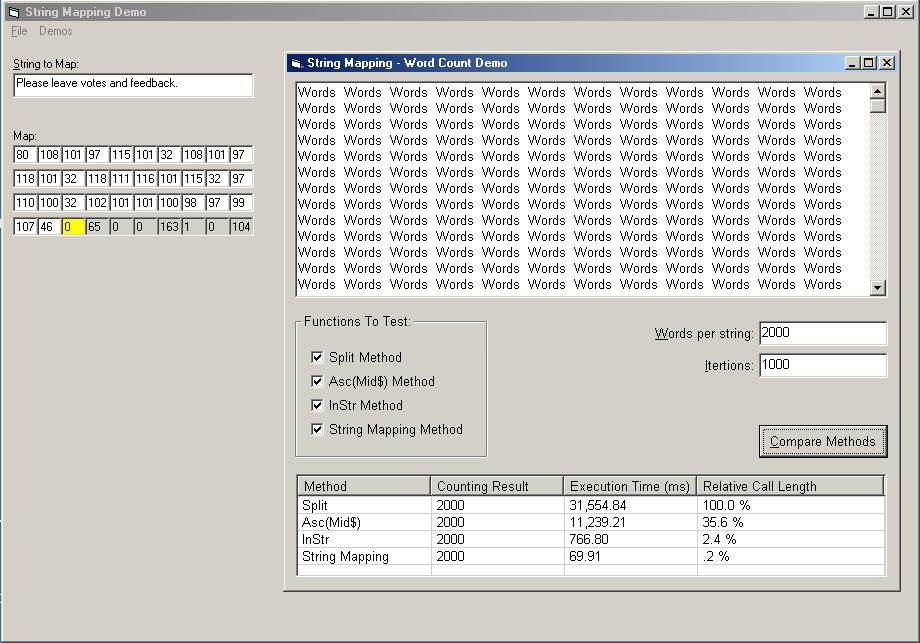



## Learn How To Make VB Handle Strings As Fast As C

### Description

If you want your strings routines to be as fast as possible, learn C. If you don't want to learn C use string mapping, its nearly as fast and pure VB. In this article I give you the silver bullet for strings. If strings are bottlenecking your code, I'm your new best friend. I've included a project that attempts to visualize the string for you. It also contains a word count comparision which uses four methods string mapping being the fastest by far (compiled).
 
### More Info
 

             |
---                |---
**Submitted On**   |2002-05-24 18:47:24
**By**             |[Chris\_Lucas ](https://github.com/Planet-Source-Code/PSCIndex/blob/master/ByAuthor/chris-lucas.md)
**Level**          |Advanced
**User Rating**    |4.8 (397 globes from 82 users)
**Compatibility**  |VB 5\.0, VB 6\.0, VB Script, ASP \(Active Server Pages\) , VBA MS Access, VBA MS Excel
**Category**       |[String Manipulation](https://github.com/Planet-Source-Code/PSCIndex/blob/master/ByCategory/string-manipulation__1-5.md)
**World**          |[Visual Basic](https://github.com/Planet-Source-Code/PSCIndex/blob/master/ByWorld/visual-basic.md)
**Archive File**   |[Learn\_How\_877765282002\.zip](https://github.com/Planet-Source-Code/chris-lucas-learn-how-to-make-vb-handle-strings-as-fast-as-c__1-34787/archive/master.zip)

